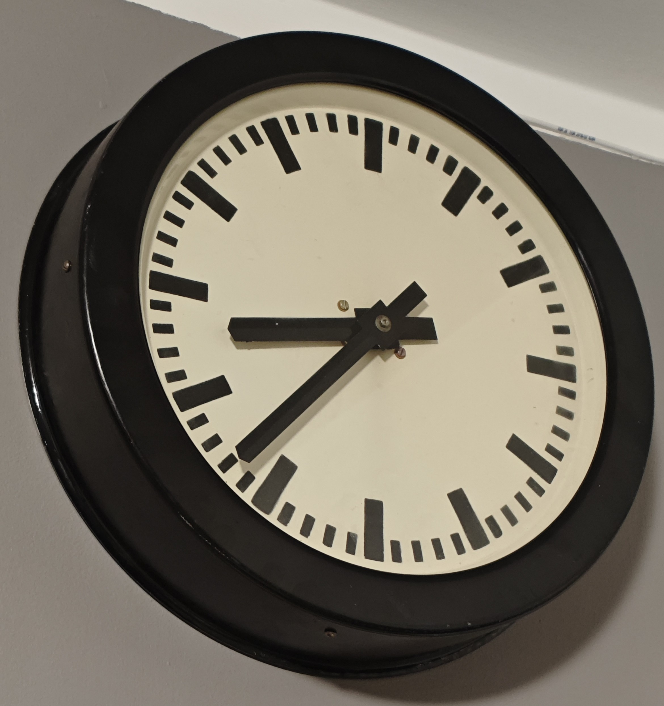
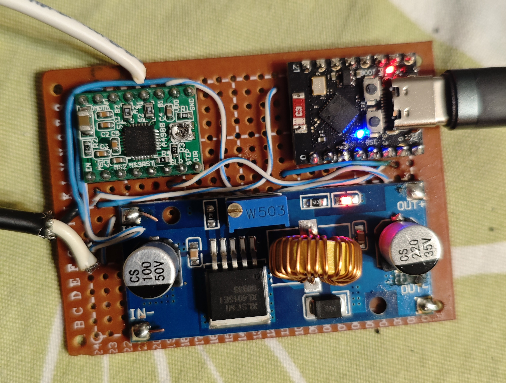

# OldTrainStationClock

Old train station clock revival using modern stepper motor driver (A4988 / DRV8825) that you perhaps have in abundance if you 3D print. ESP32-C3 Mini with MicroPython code with online time synchronization.

## The Clock



I came across an old train station clock at the flea market and bought it at a very reasonable price (100 PLN ~ 25 EUR). After fixing a small problem with the clock escapement mechanism, it was ready to work and only needed some master clock signal to drive it.

The clock mechanism is a very simple two-step stepping motor with escapement to prevent backward movement. To drive it you need to provide it with alternating 24V (in my case) DC current, changing polarization every minute (in other words, each time you switch polarization to the clock coil, it moves by 1 minute).


In days of yore, this alternating current would be produced by a master clock, mechanically switching the current circuit.

## Driver

What is needed to achieve this kind of electrical current is a full H-bridge. By definition, it is exactly the kind of electric circuit that is able to do the full switch between +/- -> -/+ pattern on its output.

### H-bridge

In the "switches" implementation that circuit would look something like below: 


And then in the operating state it would switch between the bolow states:


(The pictures after wikipedia (attribution to Cyril BUTTAY), read more on [Wikipedia](https://en.wikipedia.org/wiki/H-bridge))

The problem with real-world electronic H-bridges is that they are simple in theory. Theoretically, you can achieve that circuit with just 4 transistors (google it). And if you can go with NPN / PNP transistors, that is almost it. But when you go to higher voltages or, especially, higher currents, you will probably end up with MOSFET n-/p-channels and will realize you also need a considerably good charge pump to bump up the voltage above the threshold level to be able to use n-channel only. Imagine also what would happen if you would turn to many switches in the pictures above ON at the same time. It basically leads to shorting a transistor, and they do explode. So you need something to prevent "toxic input combinations" even for as short time as booting of your microcontroler. We are also working here with a big coil as a load. That is a lot of impedance, you need to properly secure the circuit from currents inducted in the coil, in other words, a lot of diodes. Lets just say those circuits tends to get quite complicated.

It is not impossible to make an H-bridge from scratch, of course, but it is a challenging project in itself.

### Stepper motor driver

If you have a 3d printer, especially if you modded it in any extent, you almost certainly have some stepper motor drivers in the drawer, usually A4988 or DRV8825.

What they are is, effectively, a set of 2 H-bridges with all fancy safety features (like, e.g., microstepping, that we actually don't need here). Those circuits are extremely popular, reliable, and cheap. A perfect choice for our project.

We dont need two H-bridges, so we are going to only use one of them.
At each next step, those drivers (with no microstepping) switch, for example `A out` in the following pattern:

|Step|Polarization|
|-|-|
|0|0|
|1|1|
|2|0|
|3|-1|
|4|0|
|5|1|
|6|0|
|7|-1|
|...|...|

So basically to switch the minute in our Trainstation Clock we need to make two steps each time we need it to "clack".

## Hardware

I decided to use ESP32 C3-mini, as it is an extremely small microcontroller with WiFi support and wonderful value to cost ratio. We are going to use WiFi for online time synchronization, because... why not.

The wiring diagram:


We utilize here 3 pins form ESP32-C3-mini. We use pin number `6` as `not-enabled` pin in the driver. With this one we controll if the stepper motor driver enrgizes the actual clock motor. Pin number `7` is used as `step` pin, controlling the sequence of steps. We use this one to actually make a clock tick-tack. Last, the pin number `8` is not connected enywhere outside the ESP32-C3 but it is internally wired on the board to the blue LED. We use that one to indicate the status of online time-synchronization.

While ESP32 is connected through USB to a computer, you can spare the 5V regulator, useful for testing and development. The regulator is only needed to power the microcontroller board at 5V while not connected to a computer. We use 3.3V from the ESP32 to power the stepper motor driver as well as for all logical "1" in the board connections.

This is how it looked on my breadboard:


And here is a recording of it in action:

[Recording of working clock in YouTube](https://www.youtube.com/shorts/8rk-1q7mBoA)

And then I have made it into the "final" prototyping board realization, using a bit overkill of LM2596 Step-Down COnverter as 5V regulator, case I have had it at hand.



## Software

I decided to go with MicroPython because of portability, ease of implementation, and because I didn't need to make the clock a Real-Time Application (which is a funny thing to say about a clock, to be honest).

Perhaps it is not my finest piece of computer code, as this is DIY project intended to be created quickly. It took me 2 episodes of The Office (the one when Micheal meets Jim on the conference and the previous one to that) to put it in place. 

### Features

- Persistent memory of last known clock hands positions
- Utilizing RTC of the microcontroller
- Online time synchronization over HTTP call over WiFi
- **Interactive console for live time management via USB**
- Configurable timezone with persistent storage
- ASCII art clock display in console
- WiFi credentials stored in configuration file

### Algorithm

We initialize the clock with numbers of pin used for `not_enabled_pin`, `step_pin` and `led_pin`.

- When the clock starts it reads last known position of the hands (as minutes from 12:00) from the `configuration.json` file
- Before the first time display, and then every hour, it calls an HTTP service for the current time to set up the internal RTC. This first switches the indicator LED off. If the time synchronization was successful, it will turn the LED on again. Therefore, the LED basically shows the status of the last time synchronization.
- Next, it sets the display time to the current time in a loop, with a sleep function scheduling the next tick to the beginning of the next minute (somewhere around 1 second of each minute, I don't have OCD, good enough, it's accurate, not precise)
- When it displays a time it performs `minute_ticks` in a loop until `current_display_time == target_display_time`
- Each tick: we enable the stepper motor driver, then we do 2 iterations of switching the `STEP` of the motor driver `on` -> `off`, effectively making 2 steps (as above, it makes a switch of polarization for each minute). Finally, we disable the stepper motor, just to avoid unnecessary heating of the room.
- At each tick the new `current_display_time` value is being saved persistently in `configuration.json` file

Nothing fancy, but simple and effective.

### How to set it up

1. Upload all the files to your MicroPython board
2. Edit `configuration.json` with your settings:
   - `display`: current clock hand position as `(hours % 12) * 60 + minutes`
   - `wifi_ssid`: your WiFi network name
   - `wifi_password`: your WiFi password
   - `timezone_url`: timezone URL from worldtimeapi.org (e.g., `http://worldtimeapi.org/api/timezone/Europe/Warsaw`)
3. Save and reboot the board

### Interactive Console

When connected via USB, the clock starts in interactive mode, allowing you to:

- View current displayed and actual time with ASCII art clock
- Adjust the displayed time directly (if hands got out of sync)
- Change timezone settings
- Force time synchronization
- Start automatic clock mode

**Console Commands:**
```
s, status     - Show current clock status with ASCII clock
t HH:MM       - Set displayed time (e.g., t 14:30)
+N            - Physically advance clock by N minutes
-N            - Adjust stored time back by N minutes (memory only)
z URL         - Set timezone URL
z list        - Show available timezone examples
sync          - Force RTC synchronization with online service
save          - Save current configuration
run           - Start automatic clock mode
help          - Show help menu
quit          - Exit interactive mode
```

### Configuration File

The `configuration.json` file stores:
```json
{
    "display": 503,
    "timezone_url": "http://worldtimeapi.org/api/timezone/Europe/Warsaw",
    "wifi_ssid": "your_wifi_ssid",
    "wifi_password": "your_wifi_password"
}
```

## Epilog

Happy hacking!
