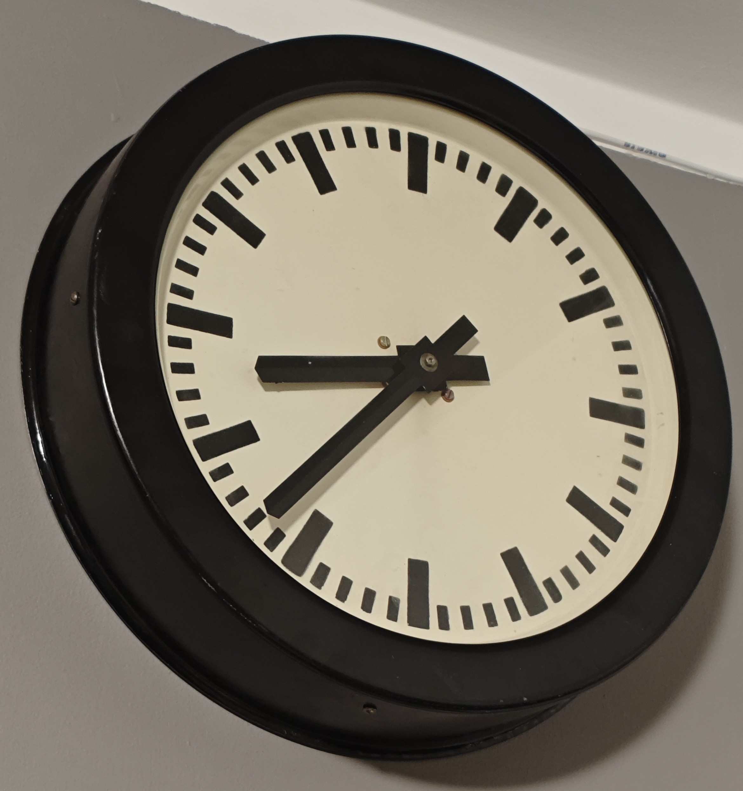
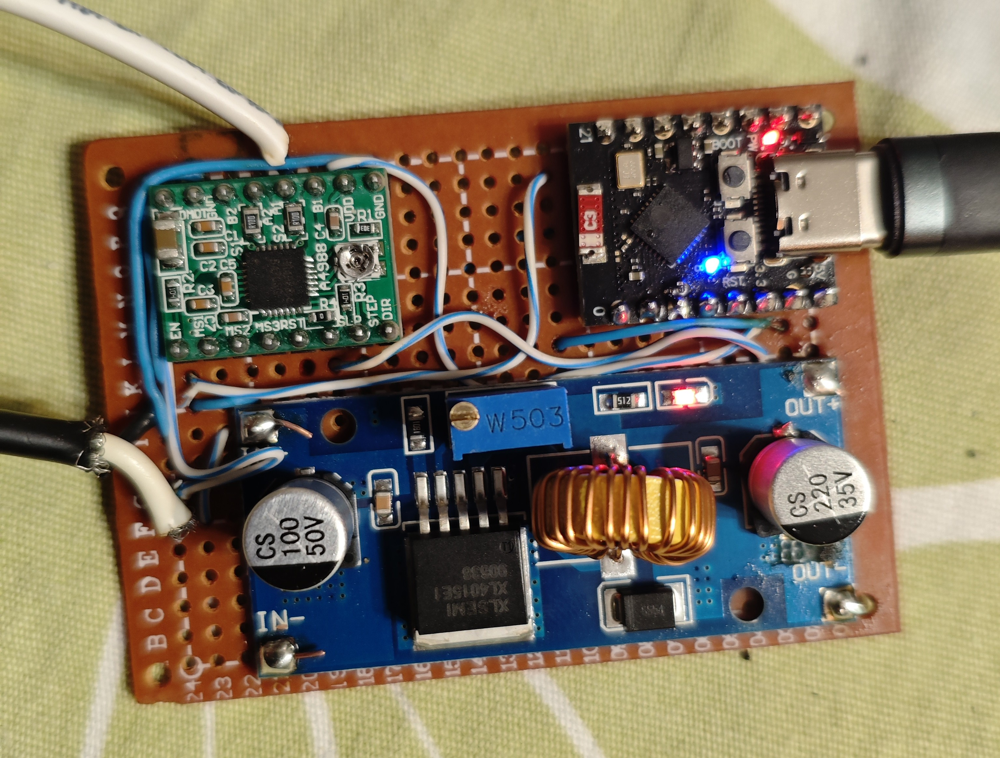

# OldTrainStationClock

Old trainstation clock revival using modern stepper motor driver (A4988 / DRV8825) that you perhaps have in abundance if you 3D Print. ESP32-C3 Mini with Micropython code with online time synchronization.

## The Clock

I have came across the old train station clock on the flea market and bought it at very reasonable price (100 PLN ~ 25 EUR). After fixing the small problem with the clock escapement mechanism it was ready to work and only needed some master clock signal to drive it.

The clock mechanism is a very simple two steps stepping motor with escapement to prevent backward movement. To drive it you need to provide it with aletrnating 24V (in my case) DC current, chinging polarization every minute (in other word, each time you switch polarization to the clock coil, it makes a move by 1 minute).

In days of youre this alternating current would be produced by a master clock, mechanicaly switching the current circuit.

## Driver

What is needed to achieve this kind of electrical current what you need is a full-H bridge. Byt definition it is exactly the kind of electric circuit that is able to do the full switch between +/- -> -/+ pattern on its output.

### H-bridge

In the "switches" implementation that circuit would look something like below: 

And then in the operating state it would switch between the bolow states:

(The pictures after wikipedia (attribution to Cyril BUTTAY), read more on [Wikipedia](https://en.wikipedia.org/wiki/H-bridge))

Problem with real world electronic H-bridges is that they are simple in theory. Theoretically you can achieve that circuit with just 4 transistors (google it). And if you can go with NPN / PNP transistors, that is almost it. But then when you go higher voltages or, especially, higher currents you probably gonna end up with MOSFET n-/p-channels and will realize you also need a considerably good charge pump to bump up the voltage above the threashold level to be able to use n-channel only. Imagine also what would happen if you would turn to many switches in the pictures above ON at the same time. It basically leads to shorting a transistor, and they do explode. So you need something to prevent "toxic input combinations" even for as short time as booting of your microcontroler. We are also working here with a big coil as a load. That is a lot of impedance, you need to properly secure the circuit from currents inducted in the coil, in other words, a lot of diodes. Lets just say those circuits tends to get quite complicated.

It is not impossible to make H-bridge from scrutch, of course, but it is a challanging project in itself.

### Stepper motor driver

If you have a 3d printer, especially if you modded it in any extent, you almost certainly have some stepper motor drivers in the drawer, usually A4988 or DRV8825.

What they are is, effectively, a set of 2 H-bridges. With all fancy safety and features also (like, eg. microstepping, that we actually dont need here). Those circuits are extremally popular, eliable and cheap. Perfect choice for our project.

We dont need two H-bridges, so we are going to only use one of them.
At each next step those drivers (with no microstepping) switch, for example `A out` in the follwing pattern:

|Step|Polarization|
|-|-|
|0|0|
|1|1|
|2|0|
|3|-1|
|4|0|
|5|1|
|6|0|
|7|-1|
|...|...|

So basically to switch the minute in our Trainstation Clock we need to make two steps each time we need it to "clack".

## Hardware

I decided to use ESP32 C3-mini, as it is extremally small microcontroler with WiFi support, wonderful value to cost ratio. We are going to use WiFi for online time synchronization, becouse... why not.

The wiring diagram:

We utilize here 3 pins form ESP32-C3-mini. We use pin number `6` as `not-enabled` pin in the driver. With this one we controll if the stepper motor driver enrgizes the actual clock motor. Pin number `7` is used as `step` pin, controlling the sequence of steps. We use this one to actually make a clock tick-tack. Last, the pin number `8` is not connected enywhere outside the ESP32-C3 but it is internally wired on the board to the blue LED. We use that one to indicate the status of online time-synchronization.

While ESP32 is connected through USB to a computer you can spare the 5V regulator, useful for testing and development. Regulator is only needed to power the microcontroller board 5V while not connected to a computer. We use 3.3V from the ESP32 to power the stepper motor driver as well as for all logical "1" in the board connections.

This is how it looked on my breadboard:

And here is a recording of it in action:

[Recording of working clock in YouTube](https://www.youtube.com/shorts/8rk-1q7mBoA)

And then I have made it into the "final" prototyping board realization, using a bit overkill of LM2596 Step-Down COnverter as 5V regulator, case I have had it at hand.

## Software

I have decided to go with Micropython becouse of portability, easiness of implementation and becouse I didn't need to make the clock Real-Time Application (which is funny thing to say about a clock, to be honest).

Perhaps it is not my finest piece of computer code, as this is DIY project intended to be created quickly. It took me 2 episodes of The Office (the one when Micheal meets Jim on the conference and the previous one to that) to put it in place. 

### Features

- Persistent memory of last known clock hands positions
- Utilizing RTC of the microcontroller
- Online time synchronization over HTTP call over WIFI

### Algorithm

We initialize the clock with numbers of pin used for `not_enabled_pin`, `step_pin` and `led_pin`.

- When the clock starts it reads last known position of the hands (as minutes from 12:00) from the `configuration.json` file
- Before the first time display, and then every hour, it calls HTTP service for the current time to set up the internal RTC. This first switches the indicator LED off. If the time sycnrhonization was successfull it will turn the LED on again. Therefor LED bascially shows the status of last time synchronization.
- Next it sets the display time to the current time in a loop, with sleep function scheduling next tick to beginning of the next minute (somewhere around 1 second of the each minute, I dont have OCD, good enough, its acurate, not precise)
- When it displays a time it performs `minute_ticks` in a loop until `current_display_time == target_display_time`
- Each tick: we enable the stepper motor driver, then we do 2 iterations of switching the `STEP` of the motor driver `on` -> `off`, effectively making 2 steps (as above, it makes a switch of polarization for each minute). Finally we disable the stepper motor, just to avoid unnecessairy heating of the room.
- At each tick the new `current_display_time` value is being saved persistently in `configuration.json` file

Nothing fancy, but simple and effective.

### How to set it up

Simply upload all the files into your Micropython board. Then edit the `configuration.json` file to a value of the current time on the clock (`60*hours + minutes`). Save everything and reboot.

## Epilog

Happy hacking!
